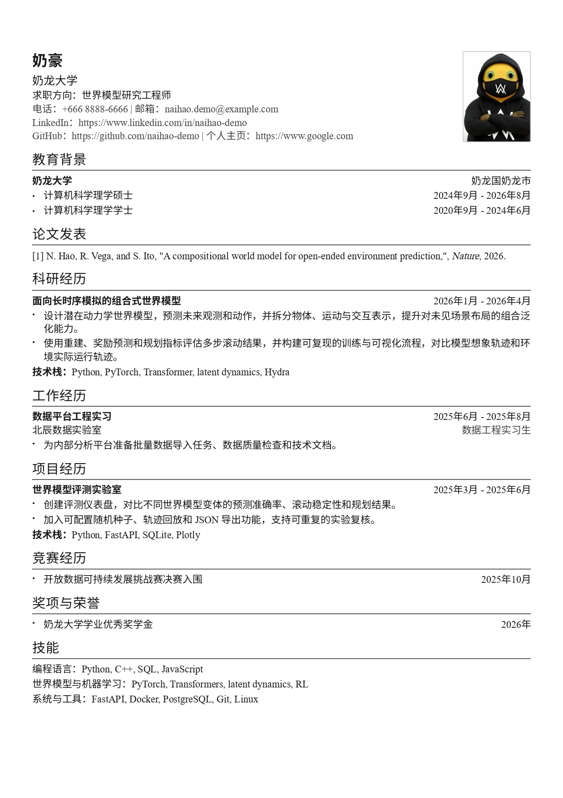
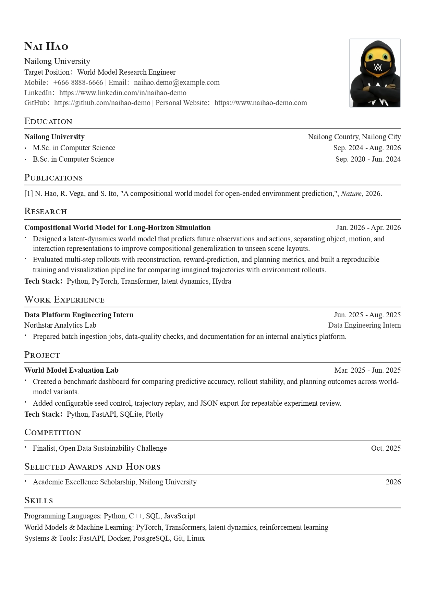
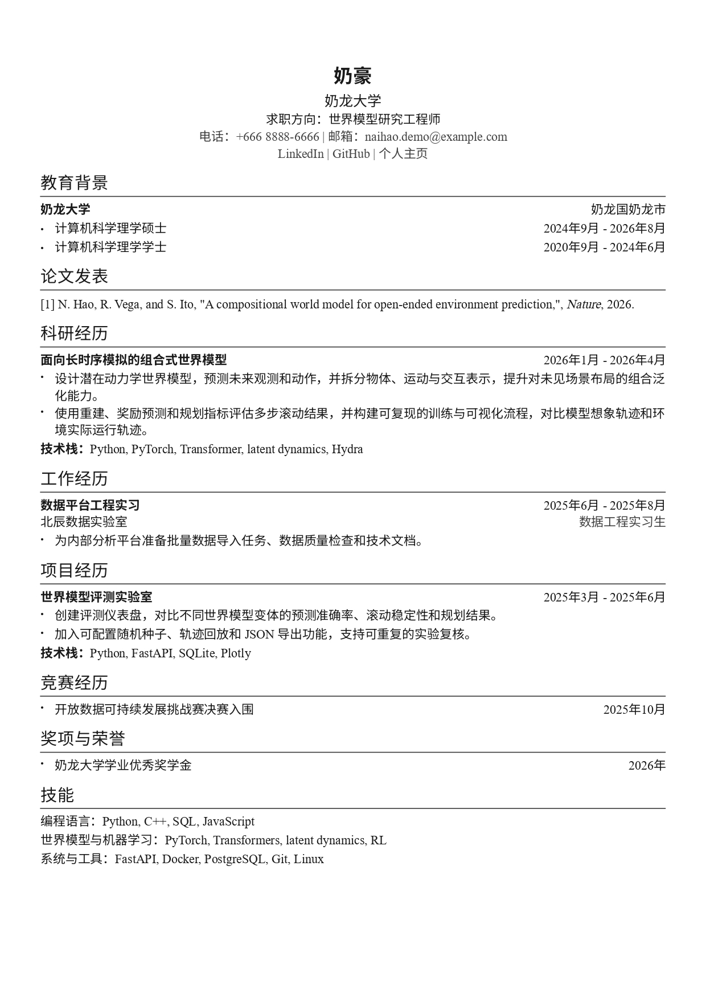
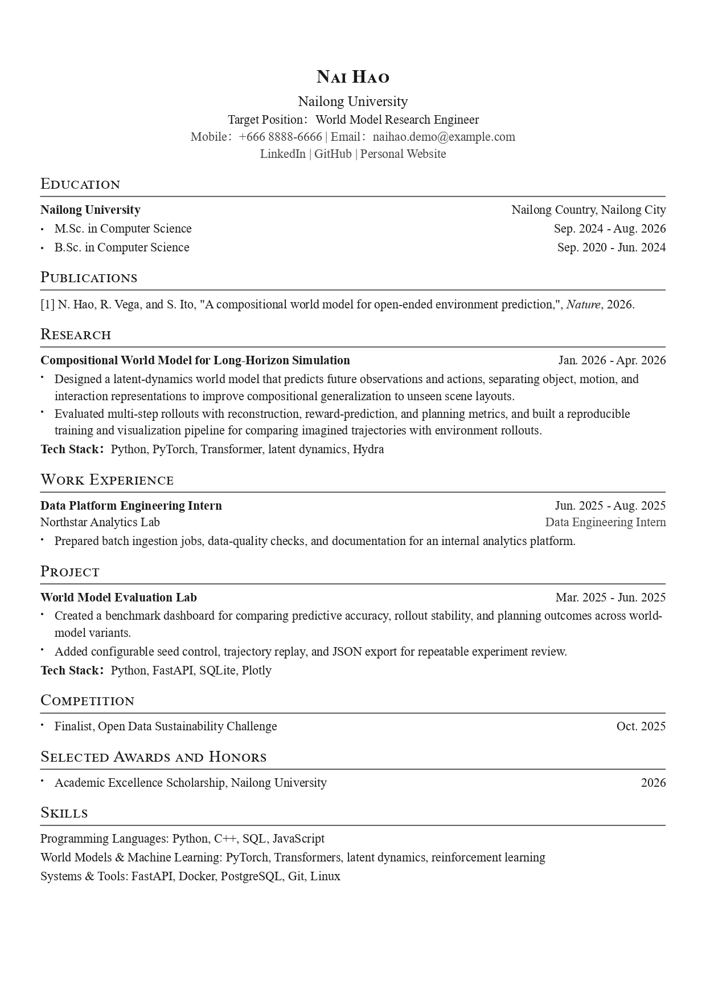

# bestResume

[中文版](README.md)

## Overview

This project is based on [easyCV](https://github.com/lvy010/easyCV). It is a YAML-driven bilingual resume system with support for:

- English and Chinese resume content
- Live browser preview
- In-browser YAML editing
- English/Chinese language switching
- A4 page pagination
- Browser print dialog for saving as PDF
- IEEE, APA, and MLA publication styles
- Windows, macOS, and Linux launchers

The layout is based on `Resume_English.docx` and uses A4 pages and a concise academic resume style. The English resume uses Times New Roman. In the Chinese resume, Chinese characters use Source Han Sans, while Latin letters, numbers, links, and English punctuation use Times New Roman.

## Resume Examples and Fonts

### Chinese Resume



Chinese characters use Source Han Sans. Latin letters, numbers, links, and English punctuation use Times New Roman.

### English Resume



The English resume uses Times New Roman.

## Quick Start

### Windows

```bat
cd bestResume
start.bat
```

### macOS

```bash
cd bestResume
chmod +x start_mac.sh
./start_mac.sh
```

### Linux

```bash
cd bestResume
chmod +x start_linux.sh
./start_linux.sh
```

The launcher creates a virtual environment, installs dependencies, and starts the server at `http://127.0.0.1:8020`.

## Pages

- [English resume preview](http://127.0.0.1:8020/resume?lang=en)
- [Chinese resume preview](http://127.0.0.1:8020/resume?lang=zh)
- [English YAML editor](http://127.0.0.1:8020/editor?lang=en)
- [Chinese YAML editor](http://127.0.0.1:8020/editor?lang=zh)

## Editing the Resume

You can edit the language-specific YAML files directly:

- `resume_english.yaml`: English resume data
- `resume_chinese.yaml`: Chinese resume data

You can also open the corresponding YAML editor in the browser, edit the content, and save it.

## Photo and No-Photo Modes

The resume automatically switches its header layout based on whether `basics.photo` is present.

### Photo Mode

Keep the `photo` field to display the basic information on the left and the photo on the right:

```yaml
basics:
  photo: "/img/奶龙证件照.jpg"
```

LinkedIn, GitHub, and the personal website use the detailed layout, showing both their labels and full URLs.

### No-Photo Mode

Comment out or remove the `photo` field when a photo is not needed:

```yaml
basics:
  # photo: "/img/奶龙证件照.jpg"
```

In no-photo mode:

- The name, school, target position, and contact details are centered as a group.
- LinkedIn, GitHub, and the personal website are combined into one row, such as `LinkedIn | GitHub | Personal Website`.
- Only the link labels are visible. Clicking a label opens its URL in a new tab.
- If a link field is missing, that item is hidden and the separators adjust automatically.

#### Chinese Resume Without a Photo



#### English Resume Without a Photo



Save the YAML file and refresh the resume preview to display the corresponding layout.

## Publications

Publications use structured YAML fields. Each entry can select `ieee`, `apa`, or `mla`:

```yaml
publications:
  - style: ieee
    authors:
      - N. Hao
      - R. Vega
      - S. Ito
    title: "A compositional world model for open-ended environment prediction"
    type: journal
    container_title: "Nature"
    year: 2026
```

Entries without a title or usable content are ignored. If all publication entries are empty, the entire Publications section is hidden.

## Project Structure

```text
resume_english.yaml   <- English resume data
resume_chinese.yaml   <- Chinese resume data
app.py                <- FastAPI server
templates/resume.html <- Resume preview template
templates/editor.html <- YAML editor page
static/style.css      <- A4 page and resume styles
start.bat             <- Windows launcher
start_mac.sh          <- macOS launcher
start_linux.sh        <- Linux launcher
```

## Printing

Click the “Print” button at the top of the preview page. In the browser print dialog, choose “Save to PDF” if you want a PDF file. No special browser installation is required.

## API

| Method | Path | Description |
|---|---|---|
| `GET` | `/resume` | Resume preview |
| `GET` | `/editor` | YAML editor |
| `GET` | `/api/resume` | Get resume JSON |
| `PUT` | `/api/resume` | Save resume JSON |
| `GET` | `/api/resume/raw` | Get raw YAML |
| `PUT` | `/api/resume/raw` | Save raw YAML |
| `GET` | `/docs` | OpenAPI documentation |

## License

MIT
